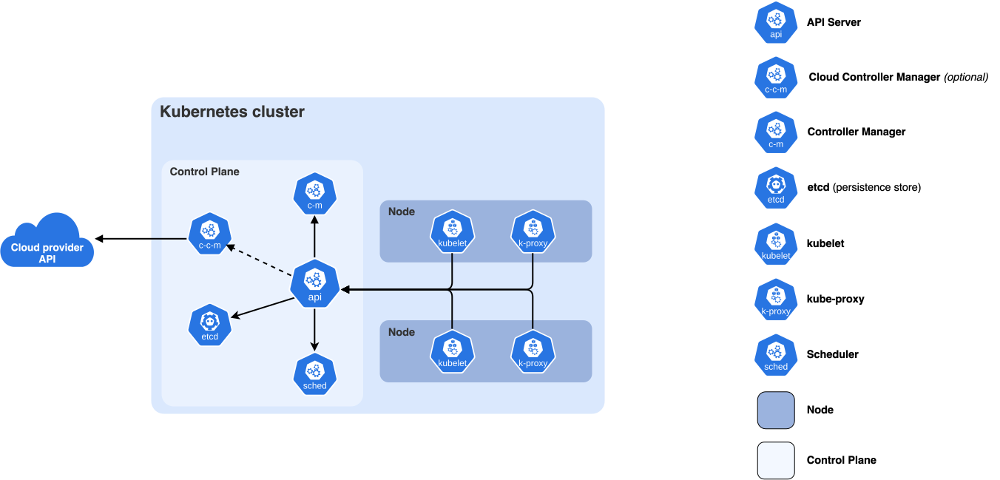

## k8s: 
- "Kubernetes architecture consists of a Control Plane and Worker Nodes. The Control Plane manages the cluster using components like the API Server, etcd, Scheduler, and Controller Manager. Worker Nodes run applications using kubelet, the container runtime, and kube-proxy. When a user creates a Deployment, the request goes to the API Server, the desired state is stored in etcd, the Scheduler selects a Worker Node, kubelet creates the Pod using the container runtime, and the Controller Manager ensures the application remains in the desired state."

---

---

## Deployment

- "A Deployment is a Kubernetes resource used to manage stateless applications. It creates and manages ReplicaSets, which in turn manage Pods. A Deployment ensures the desired number of Pods are always running, automatically recreates failed Pods, supports scaling, rolling updates, and rollbacks. The default deployment strategy is RollingUpdate, where Kubernetes gradually replaces old Pods with new ones using maxSurge and maxUnavailable to achieve minimal or zero downtime. Another strategy is Recreate, which deletes all old Pods before creating new ones, causing downtime. If a deployment fails, we can roll back to the previous version using kubectl rollout undo."

---

## Configmap
- "First, I create the ConfigMap using kubectl. Then, I reference it in the Pod using either `env` with `configMapKeyRef` for individual keys or `envFrom` to import all keys as environment variables. The application can then access them like normal environment variables."

- "A ConfigMap stores non-sensitive configuration data such as application URLs, ports, or environment variables. It helps separate configuration from the application code, making deployments more flexible."

## Networking
- "Each Pod in Kubernetes gets its own unique IP address. Containers within the same Pod share the same network namespace and communicate using localhost, while Pods communicate directly using their Pod IPs."

## service
- targetPort is the port on which the application inside the container is listening.
- `port` is the port exposed by the Kubernetes Service and used by other Pods within the cluster to access the Service.
- `nodePort` is the port opened on every Kubernetes node so external users can access the application using <Node-IP>:NodePort.-  
- will allocate a port from a range `(default: 30000-32767)`

## Ingress and Ingress controller
- "Ingress is a Kubernetes resource used to expose HTTP and HTTPS applications from outside the cluster. Instead of creating a separate LoadBalancer for each service, Ingress allows multiple services to share a single external load balancer. It supports features like `path-based` routing _(e.g., /api and /app),_ `host-based` routing (e.g., api.example.com and app.example.com), and TLS termination for HTTPS. An Ingress resource only defines the routing rules, while an Ingress Controller, such as NGINX Ingress Controller or the AWS Load Balancer Controller in EKS, implements those rules and routes the traffic to the appropriate Kubernetes Services."

## service Discovery
"We don't configure Service Discovery separately. When we create a Kubernetes Service, Kubernetes automatically assigns it a ClusterIP and CoreDNS creates a DNS entry using the Service name. Applications communicate using the Service name, such as http://product-service, and CoreDNS resolves that name to the Service's ClusterIP. The Service then forwards the request to the backend Pods selected by its labels."

## network policy
- By default, Kubernetes allows all Pods to communicate with each other. A NetworkPolicy acts like a firewall for Pods and controls which Pods can send or receive traffic. It uses Pod labels to define allowed ingress (incoming) and egress (outgoing) traffic. If a Pod is selected by a NetworkPolicy, only the traffic explicitly allowed is permitted; all other traffic is denied."

```yaml
apiVersion: networking.k8s.io/v1
kind: NetworkPolicy

metadata:
  name: allow-product

spec:
  podSelector:
    matchLabels:
      app: database

  policyTypes:
  - Ingress

  ingress:
  - from:
    - podSelector:
        matchLabels:
          app: product
```

## Node selector
- "Node Selector is the simplest scheduling method. It schedules a Pod only on nodes that have matching labels."

#### Choose one of your nodes, and add a label to it:

`kubectl label nodes <your-node-name> disktype=ssd`

```yaml
apiVersion: v1
kind: Pod
metadata:
  name: nginx
  labels:
    env: test
spec:
  containers:
  - name: nginx
    image: nginx
    imagePullPolicy: IfNotPresent
  nodeSelector:
    disktype: ssd
```

## Node affinity
- "Node Affinity schedules Pods based on node labels. It provides more flexibility than Node Selector by supporting required (mandatory) and preferred (best-effort) scheduling rules."
- `requiredDuringSchedulingIgnoredDuringExecution`: The scheduler can't schedule the Pod unless the rule is met. This functions like nodeSelector, but with a more expressive syntax.
- `preferredDuringSchedulingIgnoredDuringExecution`: The scheduler tries to find a node that meets the rule. If a matching node is not available, the scheduler still schedules the Pod.


```yaml
apiVersion: v1
kind: Pod
metadata:
  name: with-node-affinity
spec:
  affinity:
    nodeAffinity:
      requiredDuringSchedulingIgnoredDuringExecution:
        nodeSelectorTerms:
        - matchExpressions:
          - key: topology.kubernetes.io/zone
            operator: In
            values:
            - antarctica-east1
            - antarctica-west1
      preferredDuringSchedulingIgnoredDuringExecution:
      - weight: 1
        preference:
          matchExpressions:
          - key: another-node-label-key
            operator: In
            values:
            - another-node-label-value
  containers:
  - name: with-node-affinity
    image: registry.k8s.io/pause:3.8
```


## Pod Affinity
- Keep related Pods together (better performance, lower latency).
## Pod Anti-Affinity
- Keep similar Pods apart (better availability and fault tolerance).

## Pod Affinity

"Pod Affinity is used to schedule Pods close to each other, usually on the same node, to reduce network latency between applications that communicate frequently. For example, a Product application and a Redis Pod can be scheduled on the same worker node using topologyKey: kubernetes.io/hostname."

"Pod Anti-Affinity is used to schedule Pods on different nodes for high availability and fault tolerance. For example, replicas of the Product application can be placed on separate worker nodes so that if one node fails, the other replica continues serving traffic."

## Taints and Tolerations:
- Taints and Tolerations are used to control Pod placement on nodes. A `taint` is applied to a node to prevent Pods from being scheduled there, while a toleration is added to a Pod to allow it to be scheduled on a tainted node. For example, if a GPU node is tainted with `gpu=true:NoSchedule`, only machine learning Pods with a matching toleration can run on that node, while other Pods are scheduled on regular worker nodes."


