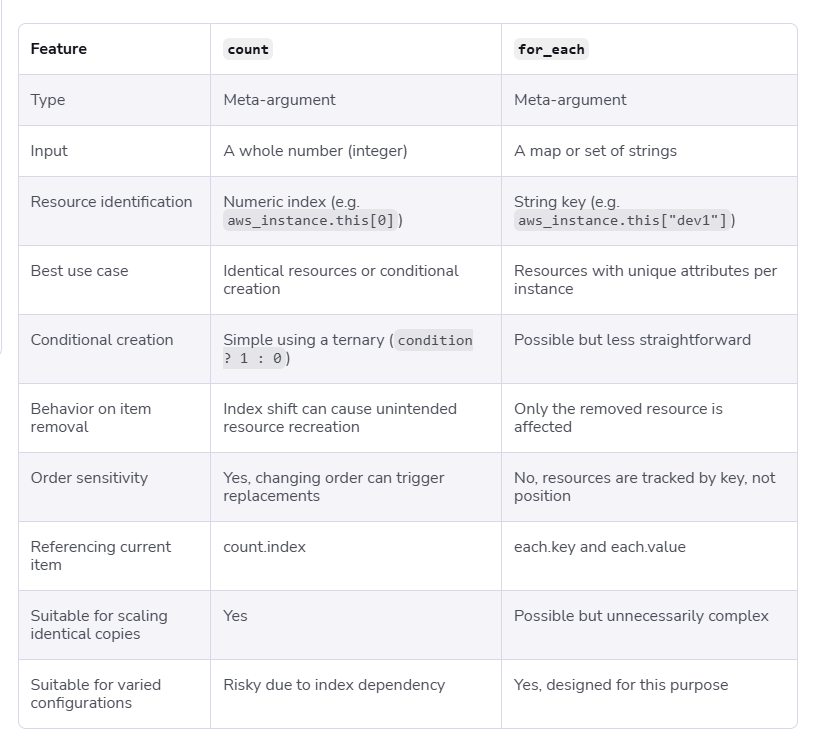

## Count
- Use the count meta-argument to manage several similar objects, such as a fixed pool of compute instances, without writing a separate block for each object. When a resource or module block includes a count argument whose value is a whole number, Terraform creates that many instances. When count appears in an action block, Terraform invokes the action the number of specified times.

- "count is used to create multiple copies (instances) of the same resource using a single resource block. Instead of writing multiple resource blocks, we specify the number of instances with count, and Terraform automatically assigns count.index (0, 1, 2, ...) to each resource."


### Drawback for count
- "The drawback of count is that Terraform tracks resources by their index. If we remove a resource from the middle, the indexes of the remaining resources shift. Terraform may interpret the shifted resource as a different one, so it can delete the old resource and recreate it at the new index. With for_each, resources are tracked by unique keys, so removing one resource does not affect the identity of the remaining resources."

- "When using count, if a resource moves from the 4th position to the 3rd position because an earlier item was removed, Terraform sees it as a different resource because it tracks resources by index, not by name. As a result, it may update or recreate resources unnecessarily. With for_each, resources are tracked by unique keys, so moving items in a list does not affect the identity of the remaining resources."

- "count tracks resources by index, so removing an item from the middle shifts indexes and can cause unnecessary changes. for_each tracks resources by unique keys, so only the removed resource is affected."

```sh
provider "aws" {
  region  = "us-west-2"
  profile = "test"
}

resource "aws_s3_bucket" "my_bucket" {
    count = length(var.s3_bucket_name)
    bucket = var.s3_bucket_name[count.index]
}

variable "s3_bucket_name" {
  description = "Name of the S3 bucket"
  type = list(string)
  default = ["dev-0246-nani", "dev-9246-nani-2"]
}
```

## for_each
- "for_each is used to create multiple resources using unique keys. It works with maps or sets. each.key returns the unique key, such as dev, qa, or prod, while each.value returns the corresponding value, such as the instance type.

- "`count` and `for_each` are both used to create multiple resources in Terraform. The main difference is that count identifies resources using numeric indexes (`count.index`), whereas `for_each` identifies resources using unique keys (`each.key`).

With count, if we remove a resource from the middle of the list, the indexes of the remaining resources shift. Since Terraform tracks resources by index, it may think the shifted resource is a different one, which can result in unnecessary updates or resource replacement.

With for_each, resources are tracked by unique keys instead of indexes. If we remove one key, Terraform removes only that specific resource, and the remaining resources keep their original identity. This makes for_each the preferred choice when resources have unique names or configurations."

Easy way to remember:

- count --> racks by index (0, 1, 2).
- for_each -->  Tracks by key (dev, qa, prod). Removing one key affects only that specific resource.



## depends_on
- `depends_on` is used to explicitly define dependencies. Terraform first creates the dependent resource, waits until it's successfully created, and only then starts creating the resource that depends on it."


## lifecycle
- `lifecycle` controls how Terraform manages resources. 
- `create_before_destroy` creates a new resource before deleting the old one to avoid downtime. 
- `prevent_destroy` protects critical resources from accidental deletion.
- `ignore_changes` tells Terraform to ignore manual changes made to specific resource attributes outside Terraform.

## s3-backend
- "The S3 backend stores the Terraform state file in an Amazon S3 bucket. It allows multiple team members to use the same state file and ensures the infrastructure state is centrally managed."

```sh
terraform {
  backend "s3" {
    buckekt = "my-terraform-state-bucket"
    key =  "statefile/terraform.tfstate"
    region = "us-west-2"
    dynamodb_table = "my-terraform-state-lock"
  }
}
```

## taint and replace
- `terraform taint` is used to mark a Terraform-managed resource for recreation. During the next terraform apply,
- Terraform destroys the existing resource and creates a new one. This is useful when a resource becomes corrupted, `unhealthy`, or `manually modified` and cannot be fixed with an in-place update. 
- In newer versions of Terraform, terraform taint is deprecated, and the recommended approach is `terraform apply -replace="<resource>"."`
- eg: `terraform apply -replace="aws_instance.web"`


## State corruption
- "If the Terraform state is stored in an `S3 backend` and the state file gets corrupted, the first thing I would check is whether `S3 versioning` is enabled. Since each update to the state file creates a new object version, I can go to the S3 bucket, select a previous healthy version of the terraform.tfstate file, and restore or copy that version as the current object. This restores the state file to a consistent state. After restoring it, I would run `terraform plan` to verify that the state, Terraform configuration, and the actual AWS infrastructure are all in sync."


## accdental deletion
- "To protect a production RDS instance from accidental deletion, I would use the lifecycle `{ prevent_destroy = true }` block in the Terraform configuration. This prevents Terraform from destroying the resource. If someone runs terraform destroy or if the resource is accidentally removed from the configuration, Terraform will throw an error instead of deleting the RDS instance."


## provisioners
- "Provisioners are used to execute scripts or commands on the local machine or on the created resource after it is provisioned. The most common provisioners are `local-exec, remote-exec, and file` However, HashiCorp recommends avoiding provisioners when possible and using cloud-init, user data, or configuration management tools like Ansible instead."

Easy way to remember
`local-exec` --> Runs on your local machine.
`remote-exec` --> Runs inside the EC2 instance.
`file` --> Copies files from your local machine to the EC2 instance.